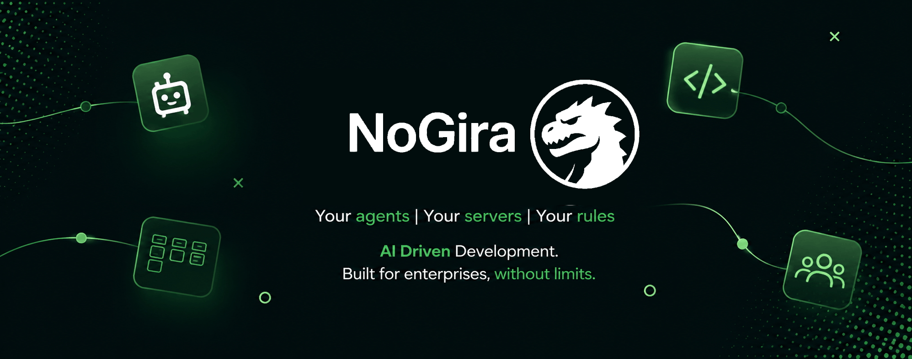
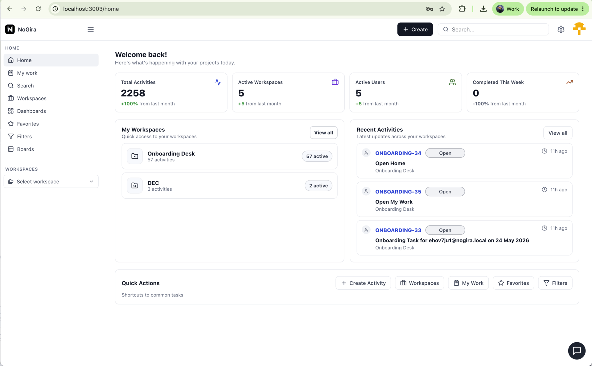
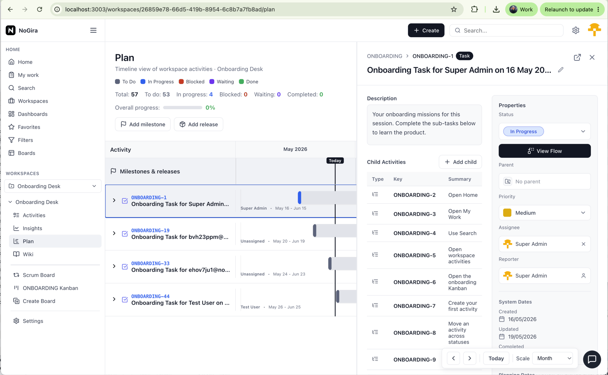
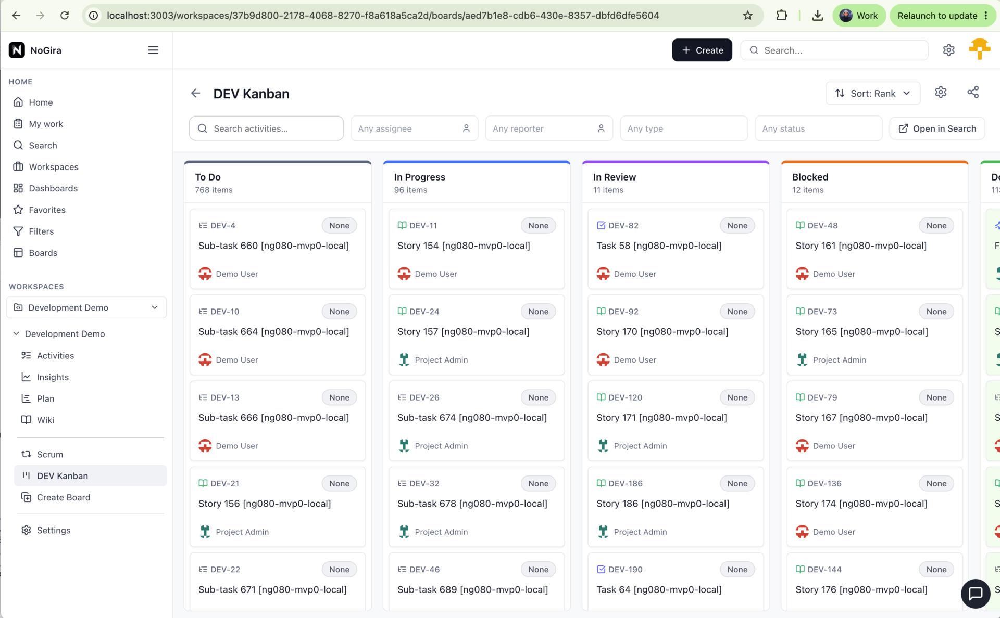
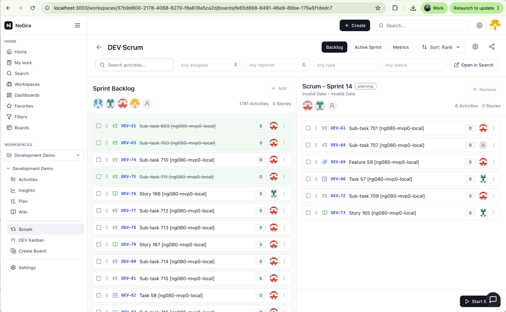
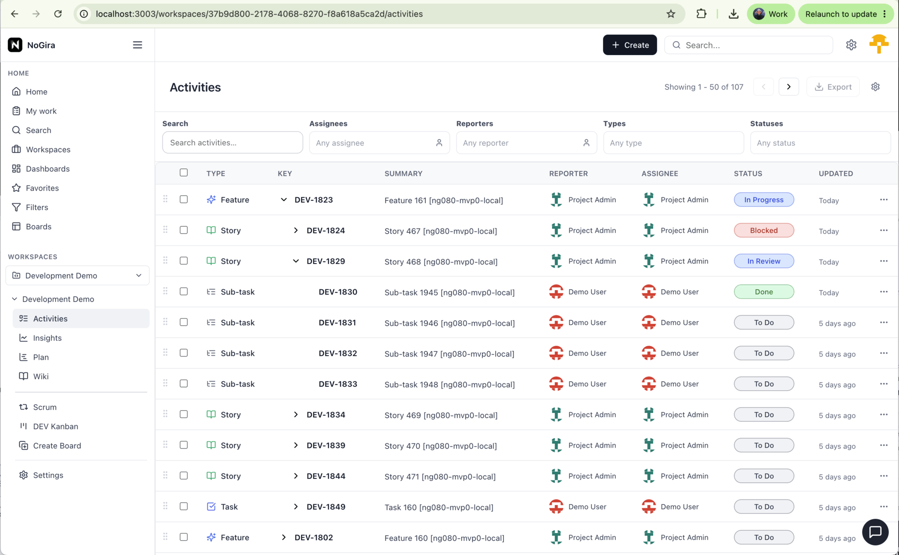
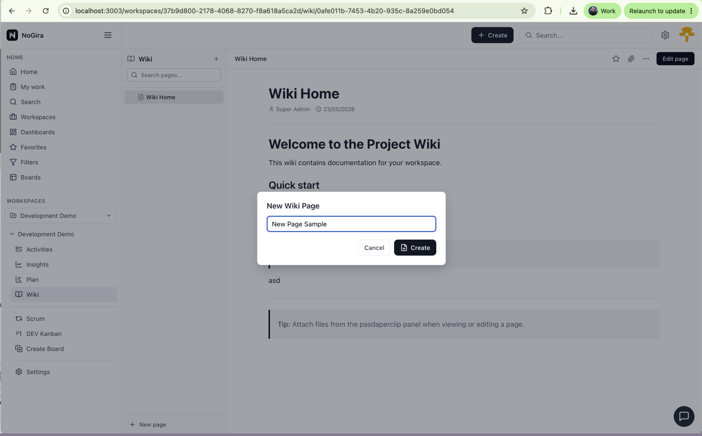
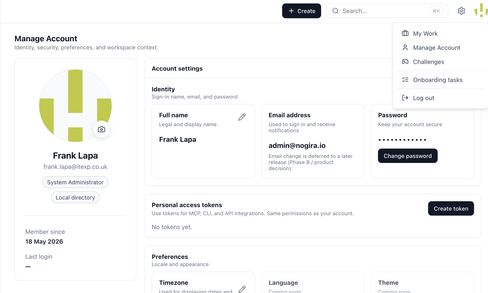
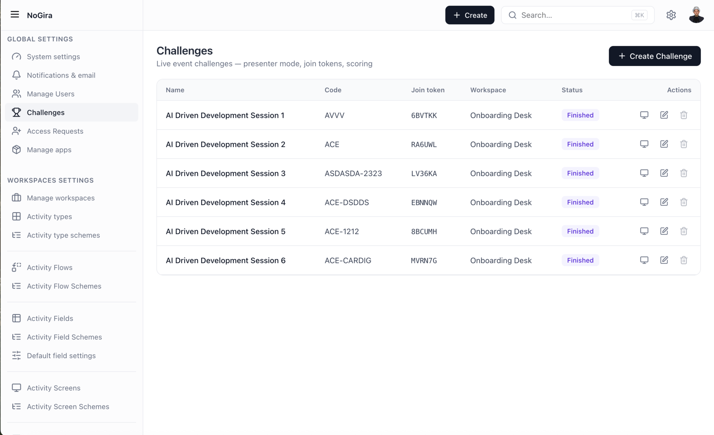

# NoGira

*Community Edition — free, self-hosted operational platform for the AI-agent era*

NoGira is a modern self-hosted operational platform designed for enterprises that require flexibility, sovereignty, and AI-ready workflows without the historical limitations of traditional project management systems.

Built from more than 12 years of enterprise delivery experience across multiple industries, NoGira combines modern architecture, simplified operational governance, and flexible workspace modelling into a platform designed for both human and AI-driven collaboration.

**This repository installs the free Community Edition** on your own infrastructure. Advanced capabilities, commercial support, and enterprise deployment options are available separately.

**Your agents | Your servers | Your rules**

## Quick Links

| Resource | Description |
|----------|-------------|
| [Quick Start](docs/quick-start.md) | Install NoGira in minutes |
| [Deployment Guide](docs/deployment.md) | Upgrades, volumes, platform support |
| [MCP Server](docs/mcp.md) | Connect Cursor, Claude Desktop and AI clients |
| [Challenge Game](docs/event-challenges.md) | Interactive onboarding and training |
| [Roadmap](docs/roadmap.md) | Product direction and upcoming capabilities |
| [Release Notes](CHANGELOG.md) | Version history and releases |
| [FAQ](docs/faq.md) | Common questions |
| [Website](https://www.nogira.io) | Product, early access, and Enterprise |

---

## Why NoGira Exists

Organisations that depend on self-hosted operational tooling face a narrowing set of viable long-term options. As legacy ALM vendors shift focus away from data-center deployments, teams need an enterprise-grade alternative that preserves sovereignty without inheriting decades of operational complexity.

NoGira addresses that gap with a distributed, container-ready architecture and a workspace-centric model built for modern governance, not a feature checklist aimed at replicating every legacy screen.

This repository is the **Community Edition installer**: a free, single-node Docker Compose path to run NoGira on your infrastructure in minutes, with full control over where data lives and how the platform evolves.

---

## What Makes NoGira Different

Unlike traditional ALM platforms, NoGira was designed from the beginning for workspace hierarchies, portfolio visibility, self-hosted deployments, and AI-assisted operational workflows.

### Modern Self-Hosted Platform

Distributed runtime, not a monolith: separate API, web UI, and notification worker containers in this installer, with room for more workers and app marketplace nodes as the platform grows. Docker Compose evaluation today; Kubernetes and private-cloud packaging on the roadmap.

### Enterprise Flexibility Without Legacy Complexity

Published activity workflows, parent and child workspaces, workspace schemes, public or private visibility, and role-based access (Guest, Member, Manager, Owner), structured for real organisational hierarchy without legacy ALM overhead.

### Operational Simplicity at Scale

Workspace permission matrix, instance and per-workspace notification policies, SMTP-backed email delivery, and workspace administration shaped by enterprise delivery experience across industries.

### Unified Operational Workspace

Kanban and Scrum boards, activities, workflows, workspace hierarchy, portfolio workspaces, full-text search, saved views, notifications, and workspace wiki in one operational model. **Coming soon:** app marketplace integrations and additional background workers.

### AI-Ready by Architecture

NoGira already exposes an **MCP Server** for AI clients such as Cursor and Claude Desktop.
Future releases will introduce AI-assisted planning, AI-powered documentation, self-hosted LLM integration, and agent-driven operational workflows while keeping data under your control.

---

## Search & Workspace Management

Home dashboard and instance-wide search with URL-persisted filters, bulk selection, CSV export, and structured workspace navigation, a unified operational entry point across teams.



---

## Activities & Workflow Management

Workspace activities with published workflows, custom fields, comments, attachments, and status transitions, with contextual panels on boards plus full detail views for consistent operational execution.



---

## Kanban Boards

Kanban boards map published workflow statuses to configurable columns and colours, with drag-and-drop execution aligned to each workspace's delivery model.



---

## Scrum Management

Run Scrum with a paginated backlog, planned/active/completed sprint lifecycle, Active Sprint Kanban, Start and Close Sprint flows, Sprint Review with per-assignee activity checklists, retrospectives, story points, and delivery metrics including commitment vs completed work, velocity, scope added after sprint start, and historical trends in activities or story points.



---

## Workspace Hierarchy & Governance

Parent and child workspaces with public or private visibility, Owner-led governance, and role-based access (Guest, Member, Manager), organisational hierarchy and isolation without fragmented tooling.



---

## Wiki & Documentation

Build hierarchical wiki pages with Markdown editing, file and image attachments, and workspace search. Reparent whole page trees as your structure evolves, and keep documentation alongside boards and activities in one platform. Favorites, tags, and live co-editing are on the roadmap.



---

## MCP Server

Connect local AI agents (Cursor, Claude Desktop, and other MCP clients) to your **self-hosted** NoGira instance over Streamable HTTP. Create a **Personal Access Token** in the UI, point the client at `http://localhost:3100/mcp`, and use tools to search activities and wiki, read and update work items — same permissions as your account, with data staying on your infrastructure.

See [docs/mcp.md](docs/mcp.md) for URLs, auth, tool list, and Cursor setup.



---

## Challenge game

Run **live event challenges** to onboard teams in an interactive way: presenters create sessions with join tokens, open a player queue, and tie missions to workspace activities. Attendees join from the profile menu or a share link, complete missions in a HUD, and see results on the leaderboard — ideal for workshops, conferences, and guided “learn by doing” sessions.

See **[docs/event-challenges.md](docs/event-challenges.md)** for a step-by-step **admin guide** (first-time presenters).



---

## Architecture Philosophy

NoGira is a **distributed platform**, not a single monolithic service. Runtime roles split across bounded containers: API server (workflows and domain logic), web UI, and a background notification worker. Additional workers and app marketplace nodes are on the roadmap. All share a workspace-centric data model for activities, workflows, boards, and wiki. Community images ship as versioned containers on [Docker Hub](https://hub.docker.com/u/nogira); this installer pins one version across API, UI, and notification worker.

The compose file in this repository targets **single-node evaluation**: straightforward secrets, internal PostgreSQL, and automatic application schema migrations on core startup. Production-style topologies (Kubernetes, private cloud, HA, enterprise governance) are part of the product direction, see [docs/deployment.md](docs/deployment.md) and [docs/roadmap.md](docs/roadmap.md) for what is supported today versus planned.

---

## Quick start

Install the **free Community Edition** with Docker Compose.

**Prerequisites:** [Docker](https://docs.docker.com/get-docker/) and Docker Compose v2.

**Community Edition images** are published on [Docker Hub, nogira](https://hub.docker.com/u/nogira) (`nogira/nogira-core`, `nogira/nogira-ui`, `nogira/nogira-notification-worker`). This installer pins a single version on all three (see `docker-compose.yml`).

```bash
git clone https://github.com/nogira-io/nogira.git
cd nogira
cp .env.example .env
```

Edit `.env` and set:

- `POSTGRES_PASSWORD`, database password (choose a strong value)
- `JWT_SECRET`, long random string (session signing)

Then start NoGira:

```bash
docker compose up -d
```

Open **http://localhost:3000** and complete the **setup wizard** (create your first administrator).

**Done.** API is on **http://localhost:4000**.

See [docs/quick-start.md](docs/quick-start.md) for more detail.

---

## Editions (open core)

NoGira follows an **open-core** model: a free self-hosted Community Edition and a commercial Enterprise offering.

| Edition | Price | What you get |
|---------|-------|--------------|
| **Community Edition** | **Free** (self-hosted) | Full core platform: workspaces, workflows, Kanban and Scrum boards, wiki, notifications, search, export, and collaboration from the Community image set |
| **Enterprise** | Commercial | LDAP, SAML/OIDC, advanced governance, enterprise licensing, high availability, marketplace capabilities, and commercial support — [contact NoGira](https://www.nogira.io) |

This repository is the **Community Edition installer** only. Application source publication will evolve on a separate roadmap. Request early access or a hosted demo at **[www.nogira.io](https://www.nogira.io)**.

---

## Documentation

| Doc | Topic |
|-----|--------|
| [docs/quick-start.md](docs/quick-start.md) | First install |
| [docs/mcp.md](docs/mcp.md) | MCP server, PAT auth, Cursor setup |
| [docs/event-challenges.md](docs/event-challenges.md) | Live event challenges — admin runbook |
| [docs/deployment.md](docs/deployment.md) | Upgrade, volumes, platform support |
| [docs/roadmap.md](docs/roadmap.md) | Product roadmap |
| [CHANGELOG.md](CHANGELOG.md) | Release index → [docs/releases/](docs/releases/) |
| [docs/faq.md](docs/faq.md) | Editions, installer vs source |

---

## Upgrade

Application database migrations run **automatically** when the core container starts.

To upgrade NoGira: edit the image tags in `docker-compose.yml` (all `nogira/*` services must use the **same version**), then:

```bash
docker compose pull
docker compose up -d
```

See [docs/deployment.md](docs/deployment.md) for volumes, rollback, and PostgreSQL lifecycle.

---

## Support matrix (evaluation)

| Environment | Support |
|-------------|---------|
| Linux **AMD64** | Supported (Docker Hub multi-arch) |
| Linux **ARM64** | Supported |
| macOS Apple Silicon | Supported for evaluation |
| Windows | **WSL2** + Docker only |

---

## Legal

- [LICENSE](LICENSE), Apache-2.0 (installer repository)
- [SECURITY.md](SECURITY.md), responsible disclosure
- [TRADEMARKS.md](TRADEMARKS.md), brand use
- [CODE_OF_CONDUCT.md](CODE_OF_CONDUCT.md)
- [CONTRIBUTING.md](CONTRIBUTING.md)
