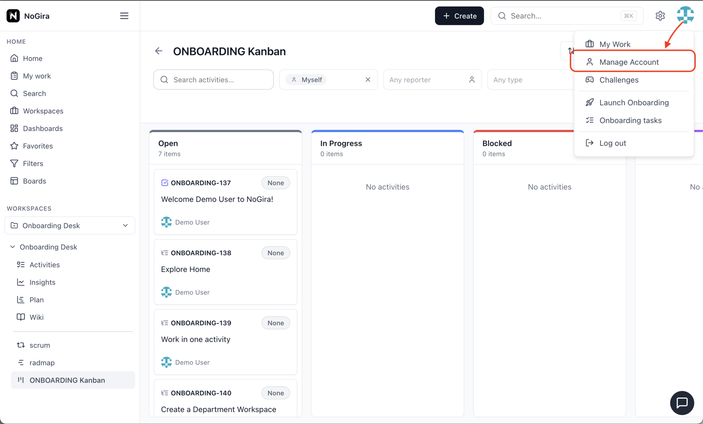

# NoGira 0.1.15

**Release date:** 2026-06-04

**User privacy and account lifecycle** (**NGF-051**) — self-service account deletion, admin archive/restore/anonymize, instance privacy toggles, onboarding wizard gate, and safer email reuse after delete. Shipped in **nogira-core** and **nogira-ui** at **0.1.15** (no extra Compose service).

**Tracking:** **NGF-051**, **NG-708**–**NG-713**, **NGB-051** (register after self-delete).

## Screenshots

*Self-service **Delete account**: open the profile menu → **Manage Account** → confirm with password. The account becomes **Deleted User** / anonymized; the same email can be used to register again when enabled by policy.*

## Added

### Account lifecycle (**NG-708**, **NG-709**, **NG-710**)

- **`UserOrigin`** and **`UserLifecycleStatus`** (`ACTIVE`, `ARCHIVED`, `ANONYMIZED`) with email partial-unique index (reuse after anonymize).
- **Self-service delete** — **Manage Account** → **Delete account** for self-registered users when **Allow account deletion** is on (**NG-709**); backend anonymizes (display **Deleted User**, clears email/password, revokes sessions).
- **Manage Users** — **All | Active | Archived** tabs (workspace parity); **Archive**, **Restore**, and **Delete user** (anonymize) actions; anonymized rows on **All** only.
- **Source** column on Manage Users and **Source of creation** in **Edit User** (**SYSTEM_ADMIN** can PATCH `origin`) (**NG-713.3**).

### System settings (**NG-712**)

- **`/settings/system`** regrouped into **Instance**, **Registration & user lifecycle**, and **Workspace** cards.
- Toggles: allow account deletion, user archiving, user anonymization, enable onboarding wizard.
- Static read-only onboarding mission checklist when the wizard is off (no preview API).

### Onboarding (**NG-713**)

- **Enable onboarding wizard** gate — when off, skip first-run modal; provision tasks and **one-time** redirect to the onboarding Kanban board.
- Topbar **Launch Onboarding** (above **Onboarding tasks**).
- Self-register + wizard-off bootstrap fixes (default profile and intent keys for mission provisioning).

## Changed

- Login and pickers respect lifecycle — archived and anonymized users cannot authenticate; assignee/search pickers show **ACTIVE** users only.
- Historical activity, wiki, and comments still show **Deleted User** for anonymized accounts (no physical user delete in privacy flows).
- **Image set** — core, UI, notification-worker, and **nogira-mcp** pinned to **0.1.15**; migrations `ng708_user_lifecycle` and `ng713_onboarding_first_run_redirected` on core startup.

## Fixed

- **NGB-051** — Re-registering with the same email after self-delete no longer returns **Internal server error**: directory usernames are released on anonymize; registration uses a transaction and clearer **409** responses when blocked.

## Upgrade notes

- Bump **all four** `nogira/nogira-*` tags in `docker-compose.yml` to **0.1.15** and `REACT_APP_VERSION` on the UI service, then `docker compose pull && docker compose up -d`.
- Hub must publish **core**, **UI**, **notification-worker**, and **nogira-mcp** at **0.1.15** with the same semver (`cicd-release.sh --version 0.1.15` after dev/uat validation).
- Upgrading from **0.1.14**: bump core, UI, worker, and MCP together; schema migrations apply on core startup (lifecycle columns + onboarding redirect flag).
- **System settings** — review new privacy toggles after upgrade; defaults allow deletion, archiving, anonymization, and onboarding wizard.
- Operators with existing anonymized users from pre-**0.1.15** may run the one-time directory-username backfill in **NGB-051** Phase 3 if re-registration still fails for old rows.
