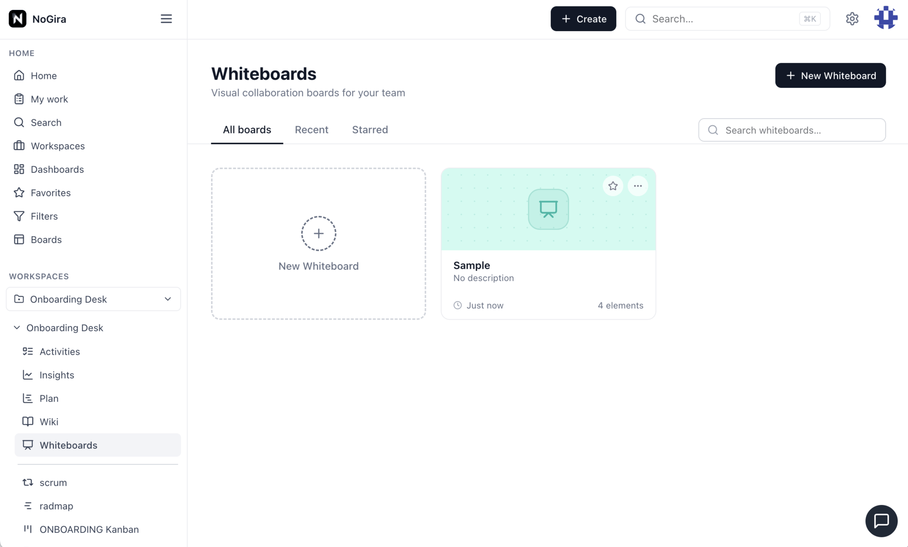

# NoGira 0.1.17

**Release date:** 2026-06-05

**Workspace Whiteboards** (**NGF-052** / **NG-714**) — visual collaboration canvas per workspace: flat list, infinite-canvas editor (sticky notes, text, shapes, connectors, images), single-Core WebSocket realtime with presence, debounced autosave, and favorites hub cards.

**Tracking:** **NG-714** (P1–P7), **NGF-052**.

## Screenshots

*Visual whiteboards in the workspace: create boards, draw elements, connect shapes, and collaborate in real time.*

## Added

- **Workspace Whiteboards** — nav below Wiki; list with search, starred tab, and create flow.
- **Whiteboard editor** — select/hand tools, sticky notes, text, rectangles, ellipses, connectors, image upload; properties panel; pan/zoom viewport persisted in `documentJson`.
- **Realtime collaboration** — WebSocket on `/api/workspaces/:workspaceId/whiteboards/:id/live`; presence avatars; last-event-wins sync.
- **Autosave** — 2s debounced REST persist + manual Save; version conflict reload.
- **Editor UX polish (P7)** — pan on empty canvas with Select tool; corner resize; edge anchor connectors with persisted sides; inline + panel text sync; connector durability fix.
- **Favorites** — **Whiteboards** tab on `/home/favorites` with `WhiteboardEntityCard` (Presentation icon, element count, workspace subtitle).
- **RBAC** — `VIEW_WHITEBOARD` / `EDIT_WHITEBOARD` / `MANAGE_WHITEBOARD` in workspace permission matrix (Wiki + Whiteboards sections).

## Changed

- **Image set** — core, UI, notification-worker, and **nogira-mcp** pinned to **0.1.17**.

## Upgrade notes

- Bump **all four** `nogira/nogira-*` tags in `docker-compose.yml` to **0.1.17** and `REACT_APP_VERSION` on the UI service, then `docker compose pull && docker compose up -d`.
- Hub must publish **core**, **UI**, **notification-worker**, and **nogira-mcp** at **0.1.17** with the same semver (`cicd-release.sh --version 0.1.17` after dev/uat validation).
- Upgrading from **0.1.16**: applies migration `20260605120000_ng714_p1_whiteboards` on core startup (Whiteboard table + favorite/storage enums).
