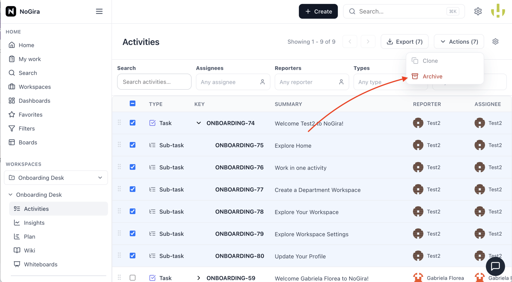

# NoGira 0.1.18

**Release date:** 2026-06-06

**Archive elements in workspace** (**NGF-044** / **NG-715**) — soft-archive activities, wiki pages, and whiteboards inside an active workspace; dedicated Archive page with bulk restore and permanent delete; VIEW_ARCHIVE permission gate on archived deep links; shared Clone + Archive actions across boards, search, and detail views.

**Tracking:** **NG-715** (P1–P6), **NGF-044**, **NGB-052** (wiki attachment restore + editor UX).

## Screenshots

*Workspace Archive: browse archived elements by type, bulk restore or permanently delete, and open read-only archived content when permitted.*

## Added

- **Workspace Archive page** — `/workspaces/:id/archive` with tabs **All | Activities | Wiki pages | Whiteboards**; sidebar badge from counts API; reuses ManageUsers table chrome and Search bulk toolbar patterns.
- **Element archive lifecycle** — unified `archivedAt` contract on activities, wiki pages, and whiteboards; audit events on archive, restore, and purge.
- **Permissions** — `VIEW_ARCHIVE`, `ARCHIVE_ACTIVITIES`, `ARCHIVE_WIKI`, `ARCHIVE_WHITEBOARD`, `RESTORE_ARCHIVED_ITEMS`, `DELETE_ARCHIVED_ITEMS` in workspace permission matrix (replaces `DELETE_ACTIVITIES`).
- **Surface integration** — Archive from activity search, workspace activities list, Kanban/Scrum boards, activity detail, wiki tree, and whiteboard list; cascade archive impact preview for activity subtrees.
- **Archived access UX** — read-only banner and restricted shell when opening archived wiki/whiteboard/activity URLs without `VIEW_ARCHIVE`; Clone + Archive shared menu on activity surfaces.
- **Whiteboard clone** — duplicate board from list/editor menus.
- **Wiki fixes (NGB-052)** — attachment restore after archive/restore; normal-text **T** toolbar button; title in breadcrumb only; blockquote cursor on line below quote.

## Changed

- **Image set** — core, UI, notification-worker, and **nogira-mcp** pinned to **0.1.18**.
- **Search & boards** — archived activities excluded from FTS, global search, board columns, plan view, and wiki tree.

## Upgrade notes

- Bump **all four** `nogira/nogira-*` tags in `docker-compose.yml` to **0.1.18** and `REACT_APP_VERSION` on the UI service, then `docker compose pull && docker compose up -d`.
- Hub must publish **core**, **UI**, **notification-worker**, and **nogira-mcp** at **0.1.18** with the same semver (`cicd-release.sh --version 0.1.18` after dev/uat validation).
- Upgrading from **0.1.17**: applies migrations `20260606120000_ngf044_archive_elements` and `20260606180000_ng715_p5_remove_delete_activities_permission` on core startup (migrates wiki/whiteboard `deletedAt` → `archivedAt`; adds archive permissions).
