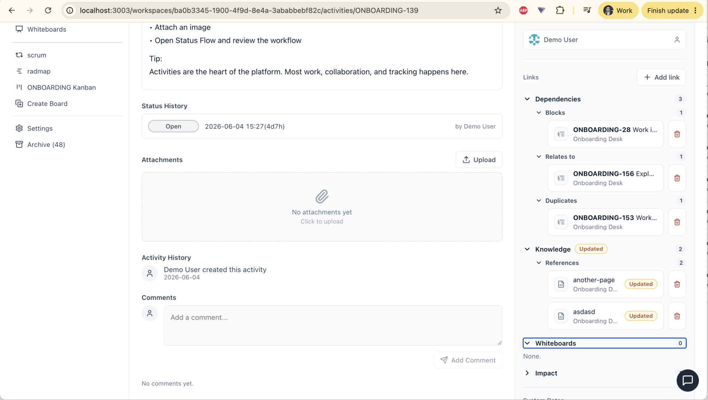

# NoGira 0.1.19

**Release date:** 2026-06-08

**Relationships & Traceability Engine** (**NGF-062** / **NG-719**) — link activities to each other, wiki pages, and whiteboards with system-defined relationship types; automatic backlinks, impact analysis, plan dependency lines, and editor-driven links from wiki and whiteboard content.

**Tracking:** **NG-719** (P1–P7), **NG-720**, **NGF-062**, **NGB-054** (wiki activity mention round-trip).

## Screenshots

*Cross-entity traceability: add links from activity detail, see backlinks on wiki and whiteboards, and visualize **Blocks** dependencies on the plan timeline.*

## Added

- **Activity Links panel** — on activity detail: **Dependencies** (Blocks / Relates To / Duplicates), **Knowledge** (Specification / Design / Reference to wiki pages), **Whiteboards** (Reference), and **Impact** (transitive Blocks graph).
- **Add link modal** — search activities, wiki pages, and whiteboards; recent picks from global search history (**NG-720**).
- **Relationship APIs** — `/api/relationships/*` CRUD with one-type-per-pair semantics; cross-workspace links when both endpoints are readable.
- **Wiki backlinks** — **Used by activities** sidebar on wiki pages with `[Updated]` badge when the page changed after link date.
- **Whiteboard backlinks** — **Referenced by** sidebar on whiteboard editor with updated detection.
- **Plan dependency lines** — **Blocks** edges rendered as SVG overlay on `/workspaces/:id/plan`.
- **Editor mentions** — `/activity` slash command in wiki and whiteboard editors creates a relationship and embeds a stable activity reference card in markdown.
- **Archive integration** — archive modals warn with inbound relationship counts; archived endpoints hide links until restored; purge removes relationship rows.

## Changed

- **Links UX labels** — activity panel renamed from “Relationships” to **Links**; modal action **Add link** (**NG-720**).
- **Image set** — core, UI, notification-worker, and **nogira-mcp** pinned to **0.1.19**.

## Fixed

- **Wiki activity embeds (NGB-054)** — stable `{{nogira-mention:activity:…}}` tokens survive save/reload; view renderer shows inline cards with type icon and status; multi-mention pages no longer corrupt markdown.

## Upgrade notes

- Bump **all four** `nogira/nogira-*` tags in `docker-compose.yml` to **0.1.19** and `REACT_APP_VERSION` on the UI service, then `docker compose pull && docker compose up -d`.
- Hub must publish **core**, **UI**, **notification-worker**, and **nogira-mcp** at **0.1.19** with the same semver (`cicd-release.sh --version 0.1.19` after dev/uat validation).
- Upgrading from **0.1.18**: applies migration `20260607120000_ngf062_entity_relationships` on core startup (`EntityRelationship` table + relationship type enums).
