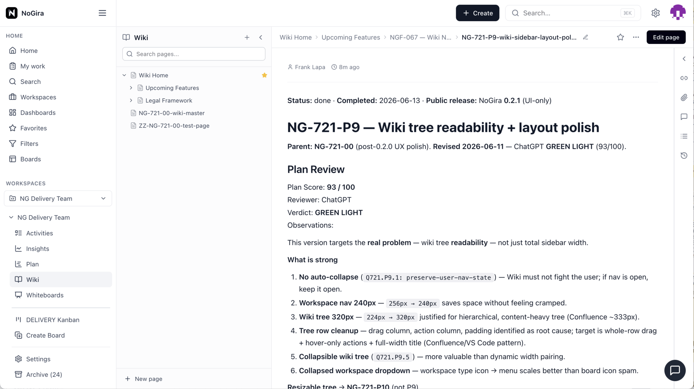

# NoGira 0.2.1

**Release date:** 2026-06-13

**Wiki layout polish** (**NGF-067** / **NG-721-P9**) — UI-only patch after **0.2.0**: wider wiki tree, slimmer workspace nav, whole-row tree drag, collapsible page tree, collapsed-nav workspace menu, and keyboard dismiss fixes.

**Tracking:** **NG-721-P9**, **NGF-067**.

## Screenshots

*Wiki tree at 320px with hover row actions, collapsible tree toggle, and collapsed workspace type-icon dropdown. Add `nogira-wiki-layout-polish.gif` under `docs/assets/` before publishing the installer tag.*

## Changed

- **Workspace nav (expanded)** — **256px → 240px** via `--workspace-sidebar-width`.
- **Wiki tree sidebar** — **224px → 320px** via `--wiki-sidebar-width`.
- **Tree rows** — whole-row drag (no grip column); `+` / `…` hover overlay; actions stay visible on selected row; tighter padding; title tooltip.
- **Collapsible wiki tree** — session-stable toggle; content expands when tree hidden.
- **Collapsed workspace nav** — workspace type icon opens full workspace menu dropdown (replaces per-board icon strip).

## Fixed

- **P9-BUG-001** — Wiki modals dismiss on **Escape** (same as Cancel): New Wiki Page, Change parent, Insert Image, Insert Mermaid (`useCancelOnEscape`).
- **P9-BUG-002** — Tree row `…` menu stacks above expanded child rows (`is-menu-open` z-index).
- **Collapsed workspace dropdown** — **Escape** closes open menu.

## Upgrade notes

- Bump **all four** `nogira/nogira-*` tags in `docker-compose.yml` to **0.2.1** and `REACT_APP_VERSION` on the UI service, then `docker compose pull && docker compose up -d`.
- **UI-only** — no new core migrations; core, notification-worker, and nogira-mcp tags move with the installer semver for pin parity.
- Hub must publish images at **0.2.1** after dev/uat validation (`cicd-release.sh --version 0.2.1`).
