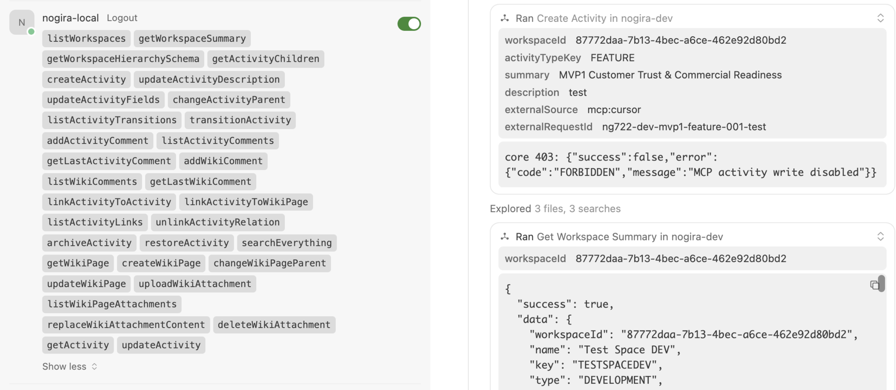
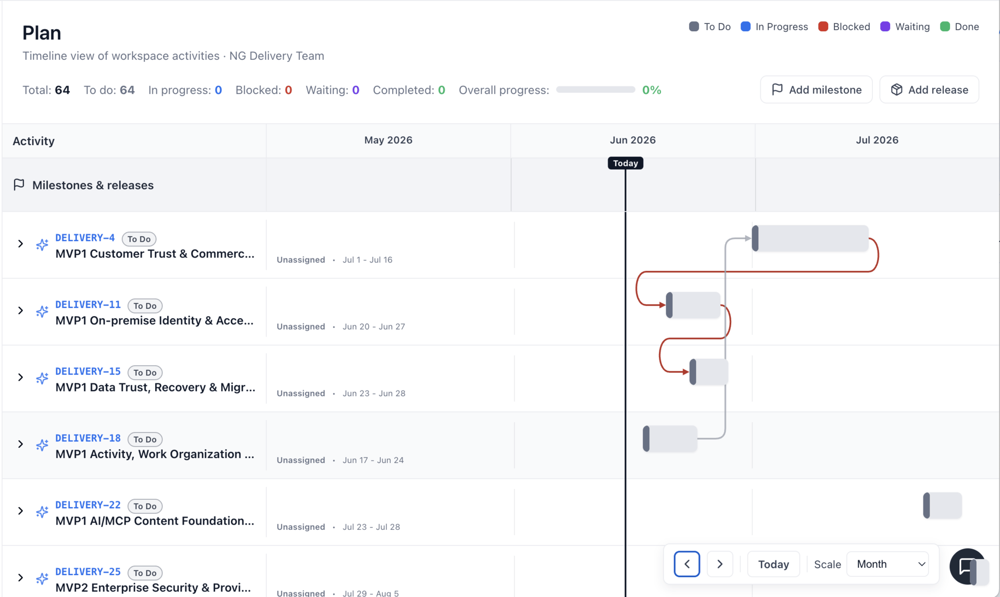

# NoGira 0.3.x series

**Series start:** 2026-06-14 · **Current tag:** **0.3.7**

**NGF-079** / **NG-722** delivery line — safe MCP activity operations, Plan Board timeline and dependency polish, workspace plan correctness, activity/board technical fixes, and wiki Export to PDF.

Use this page as the **high-level index** for every **0.3.\*** installer release. Each patch version has its own child release note with upgrade steps.

## Releases

| Version | NGF | Feature | Slice | Status | Link |
|---------|-----|---------|-------|--------|------|
| **0.3.7** | **NGF-067** / **NGF-079** | **Wiki Configure block editor** <small>Separator canonicalization, active text surface, format toolbar, inter-block boundaries, block-insert split, textarea autosize (**NG-722-P16–P21**).</small> | mvp1 | **done** | [Release 0.3.7](release-0-3-7) |
| **0.3.6** | **NGF-079** | **Wiki Export to PDF** <small>Server-side PDF from wiki page actions; macro-aware HTML rendering (**NG-722-P14/P15**).</small> | mvp1 | **done** | [Release 0.3.6](release-0-3-6) |
| **0.3.5** | **NGF-079** | **Activity & board technical fixes** <small>ASSIGNABLE_USER scoping, Scrum backlog all-types, activities list polish; **NGB-055** open for rank DnD.</small> | mvp1 | **done** | [Release 0.3.5](release-0-3-5) |
| **0.3.4** | **NGF-079** | **Plan ghost scheduling & dependency warnings** <small>30-day ghost bars for unscheduled rows; date-based overlap warnings (**NG-722-P11/P12**).</small> | mvp1 | **done** | [Release 0.3.4](release-0-3-4) |
| **0.3.3** | **NGF-079** | **Plan Board dependency editing** <small>Timeline bar edit, dependency lines between bars, connector polish (**NG-722-P8/P9/P10**).</small> | mvp1 | **done** | [Release 0.3.3](release-0-3-3) |
| **0.3.2** | **NGF-044** | **Plan excludes archived activities** <small>Workspace `/plan` and portfolio rollup hide archived rows (**NG-723**).</small> | mvp1 | **done** | [Release 0.3.2](release-0-3-2) |
| **0.3.1** | **NGF-079** | **UI follow-on polish** <small>Persisted nav/wiki tree state, semantic toasts, create-activity stay-in-context (**NG-722-P4–P7**).</small> | mvp1 | **done** | [Release 0.3.1](release-0-3-1) |
| **0.3.0** | **NGF-079** | **MCP activity operations foundation** <small>Safe MCP create/move/transition/comment/link/archive with idempotent external metadata (**NG-722**).</small> | mvp1 | **done** | [Release 0.3.0](release-0-3-0) |

## Highlights

### 0.3.0 — MCP activity operations foundation

- **MCP activity tools** for workspace context, hierarchy-safe create, workflow transitions, comments, explicit activity↔activity and activity↔wiki links, archive/restore.
- **Idempotent external-create metadata** on activities and wiki pages (`externalSource` + `externalRequestId`).
- **Safe mutation model** — no raw status/parent patches on the AI surface.

### 0.3.1 — UI follow-on

- Left nav and wiki tree collapse state persist across refresh.
- Create Activity success stays on the current page; semantic toast variants (green/blue/yellow/red).
- Wiki tree archive/reparent and collapsed-branch warnings use product toasts.

### 0.3.2 — Plan archive filter

- **`GET /api/workspaces/:id/plan`** and portfolio plan rollup exclude archived activities.

### 0.3.3 — Plan Board dependency editing

- Drag/resize timeline bars without accidental row selection.
- Create **BLOCKS** dependencies by dropping between bars; dependency details dropdown on connector click.
- Orthogonal dependency routing, overlap styling, and inverse-S routes for readable connectors.

### 0.3.4 — Ghost scheduling & dependency warnings

- Translucent **ghost schedule bars** on fully unscheduled Plan rows (click or drag to persist dates).
- Red dependency warnings use **`source.dueDate > target.startDate`**, not rendered bar overlap alone.

### 0.3.5 — Activity & board technical fixes

- **`ASSIGNABLE_USER`** permission and **`GET …/members/assignable`** for scoped assignee pickers.
- Scrum backlog lists all valid unsprinted types; activities tree keeps expanded parents on silent refresh; **Priority** in default columns.
- Kanban/Scrum same-column rank shows insertion-line affordance (**NGB-055** — persistence still open).

### 0.3.6 — Wiki Export to PDF

- **`GET /api/wiki/pages/:pageId/export/pdf`** with `VIEW_WIKI` gate, metadata header, and footer page numbers.
- Wiki **Export to PDF** in page actions menu; `puppeteer-core` + Chromium in core image.
- PDF export renders builtin wiki macros (toc, callout, child pages, attachments, activity list) as print-friendly HTML (**NG-722-P15**).

### 0.3.7 — Wiki Configure block editor

- Horizontal separator canonicalization (`---` emit; parse `---`/`***`/`___`) — **NG-722-P16** / **NGB-056**.
- Active text-block editing surface preserves preview affordance — **NG-722-P17**.
- Format toolbar sections + modal Escape dismiss — **NG-722-P18**.
- Inter-block markdown boundaries + block-insert split at caret — **NG-722-P19** / **NGB-057**.
- WYSIWYG caret → markdown offset for formatted splits — **NG-722-P20** / **NGB-058**.
- Split-after plain-text textarea autosize on mount — **NG-722-P21** / **NGB-059**.

## Upgrade path

1. Start from your current **0.2.x** or **0.3.x** tag in `docker-compose.yml`.
2. Bump **all four** `nogira/nogira-*` image tags and `REACT_APP_VERSION` to the target **0.3.x** version.
3. Run `docker compose pull && docker compose up -d`.
4. **0.3.0 only:** apply Prisma migrations `20260614120000_ngf079_activity_external_metadata` and `20260614130000_ngf079_wiki_page_external_metadata`.
5. **0.3.6:** allow extra pull time — core image includes Chromium for PDF export.

**Tracking:** **NG-722**, **NG-723**, **NGF-079**, **NGF-044**, **NGF-017**.
