# Wiki macros

Wiki **macros** are dynamic blocks embedded in page markdown. They render as rich UI in **View** and **Editor** tabs; in the **Markdown** tab you see the raw `{{…}}` syntax.

Macros are the main way to add **table of contents**, **child page listings**, **activity tables**, **attachment lists**, and **callouts** without hand-building HTML.

> Prerequisites: [Wiki guide](wiki.md) — editor modes, slash commands, Page Context Sidebar.

## How macros work

### Three display modes

| Mode | Tab | Macro appearance |
|------|-----|------------------|
| **View** | View | Fully rendered card or panel; no Configure button |
| **Edit Render** | Editor | Same render + **Configure** (gear) on each macro block |
| **Edit Markdown** | Markdown | Exact stored syntax, e.g. `{{toc}}` |

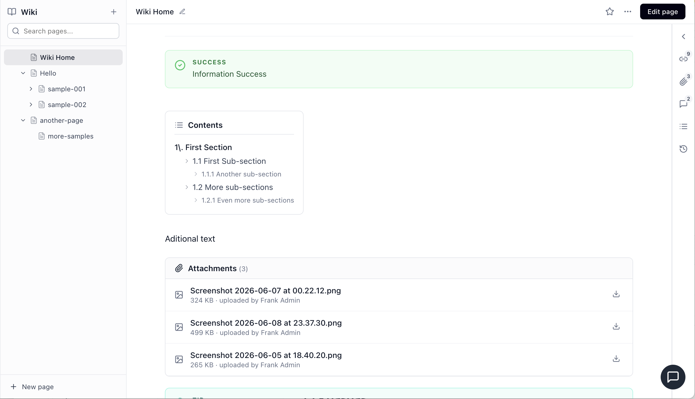

* **View** tab — macros render as finished UI; readers do not see `{{…}}` syntax.*

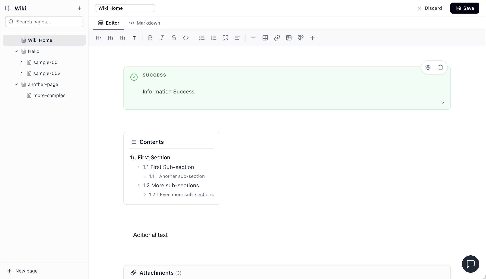

* **Editor** tab — same render plus **Configure** on each macro block.*

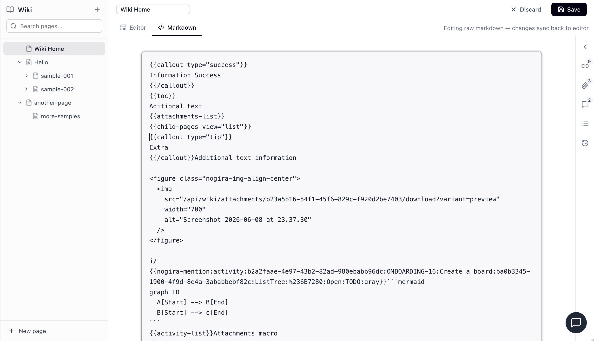

* **Markdown** tab — exact stored tokens for paste, import, or Git-style review.*

### Insert a macro

| Method | Example |
|--------|---------|
| **Slash menu** | In Editor, type `/toc`, `/child-pages`, `/activity-list`, … |
| **Toolbar +** | Same commands as slash menu |
| **Markdown tab** | Paste token manually, then Save |

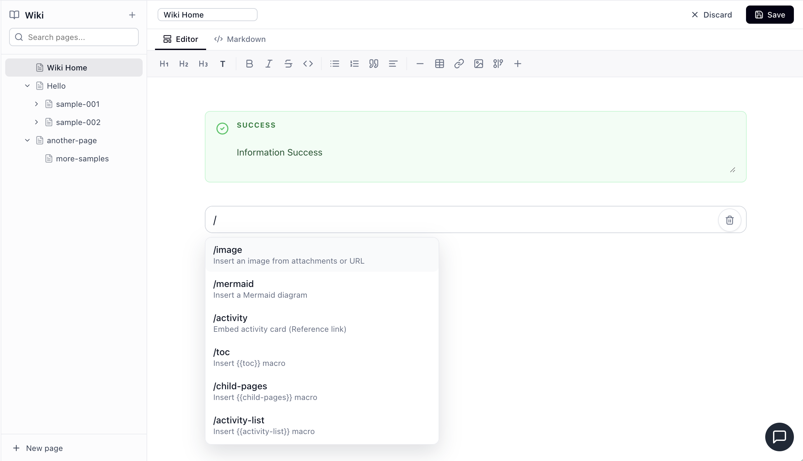

*Type `/toc`, `/child-pages`, or `/callout` in a text block, or use toolbar **+**.*

### Configure a macro

1. Open the page in **Editor** tab.
2. Click the macro block.
3. Click **Configure** (top-right of the block).
4. Adjust fields in the right panel (width ~18rem / 288px).
5. **Save** the page.

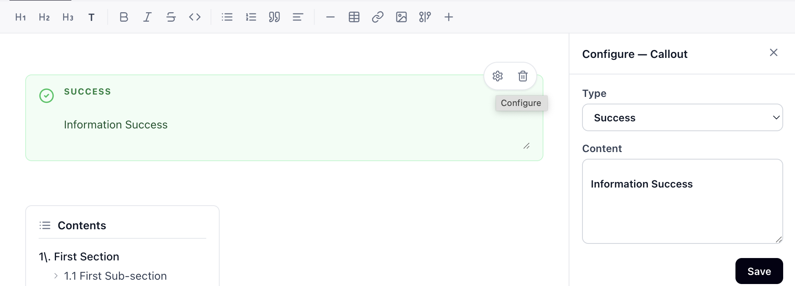

* **Configure** opens macro-specific fields in the right panel (not the Page Context Sidebar tabs).*

Configuration is stored in the macro token attributes (e.g. `view="gallery"`). Nested macros are **not** supported in MVP1.

### Empty macros

| Macro | When empty |
|-------|------------|
| `{{child-pages}}` | **Hidden** — nothing rendered |
| `{{toc}}` | Shows “No headings found.” |
| `{{activity-list}}` | Empty table / zero rows |
| `{{attachments-list}}` | Empty list or zero rows |

---

## Macro reference

### Table of contents — `{{toc}}`

Builds a clickable list of headings from the **current page body** (H1–H3).

**Syntax**

```markdown
{{toc}}
```

**With options** (via Configure or attributes)

```markdown
{{toc depth="2"}}
```

| Option | Default | Values |
|--------|---------|--------|
| **Depth** | 3 | 1, 2, or 3 heading levels |
| **Include H1 / H2 / H3** | all on | Toggle per level in Configure |

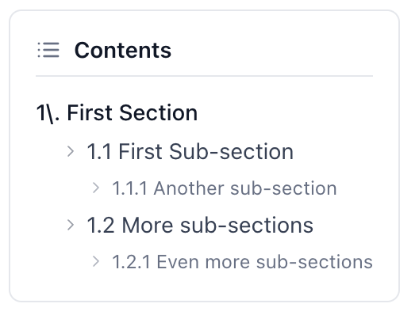

*`{{toc}}` inline card with heading links; click to scroll in-page.*

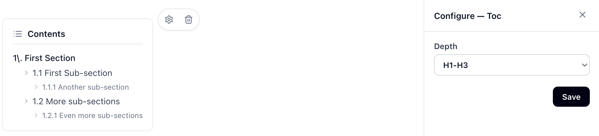

*Configure panel: depth 1/2/3 and include H1/H2/H3 checkboxes.*

**Dual surface**

- Inline macro in the page body (card with “Contents” header).
- **Page Context Sidebar → Contents tab** — same heading index in compact form (see [Wiki guide — Contents tab](wiki.md#page-context-sidebar)).

Click a heading link to scroll to that section (in-page).

---

### Child pages — `{{child-pages}}`

Lists wiki pages whose **parent** is the current page (and optionally deeper levels).

**Syntax**

```markdown
{{child-pages}}
{{child-pages view="cards" depth="2" sort="updated" direction="desc"}}
```

| Attribute | Default | Values |
|-----------|---------|--------|
| `view` | `cards` | `list` · `cards` · `gallery` |
| `depth` | `1` | `1`–`3` (direct children = 1) |
| `sort` | `title` | `title` · `created` · `updated` |
| `direction` | `asc` | `asc` · `desc` |

**Configure panel**

- View: List / Cards / Gallery
- Depth: 1 / 2 / 3
- Sort by + direction
- Toggles: show summary, author, last updated
- Pagination: page size 20 or 50 + **Load more**

**Behaviour**

- **Empty** (no children) → macro produces **no output** in View mode.
- **Non-empty** → collapsible header **Child Pages (N)** with optional view switcher in the header.
- Collapse state can be remembered per user and workspace.

**Views**

| View | Layout |
|------|--------|
| **Cards** | 2–3 column grid — icon, title, excerpt, relative updated time |
| **List** | Rows — icon, title, author, date |
| **Gallery** | Thumbnail gradient, title, metadata |

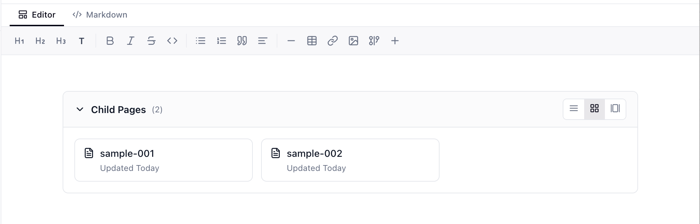

*Default **cards** view — collapsible **Child Pages (N)** header and grid layout.*

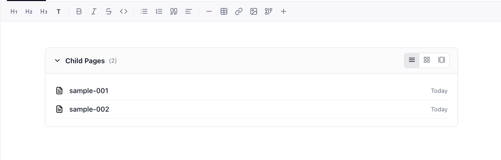

* **List** view — compact rows with author and date.*

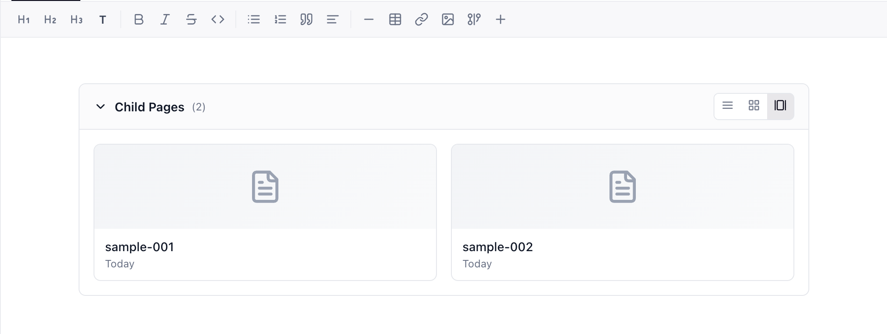

* **Gallery** view — thumbnail tiles with title and metadata.*

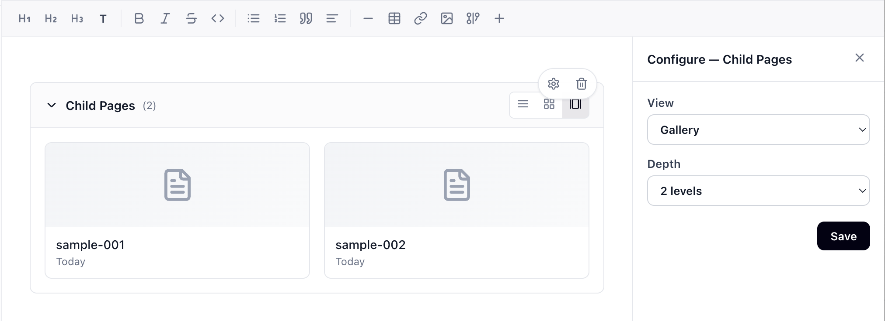

*Configure: view mode, depth, sort, display fields, and pagination.*

---

### Activity list — `{{activity-list}}`

Renders a **table** of activities linked to the current wiki page (via the relationships engine).

**Syntax**

```markdown
{{activity-list}}
{{activity-list columns="key,summary,status,assignee,priority"}}
```

**Default columns:** Key · Summary · Status · Assignee · Priority

**Configure panel** (mirrors `/home/search` patterns)

- **Filters:** status, priority, assignee, reporter, labels
- **Columns:** checkboxes per column
- **Sort by** + ascending/descending
- **Load more** for pagination

**Table only** — no board, timeline, or calendar view in the macro.

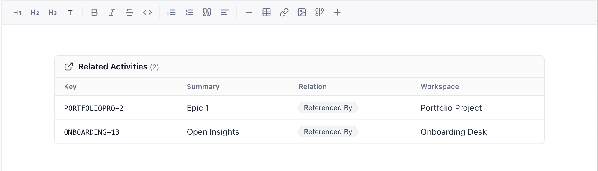

*`{{activity-list}}` — Key, Summary, Status, Assignee, Priority columns with status badges.*

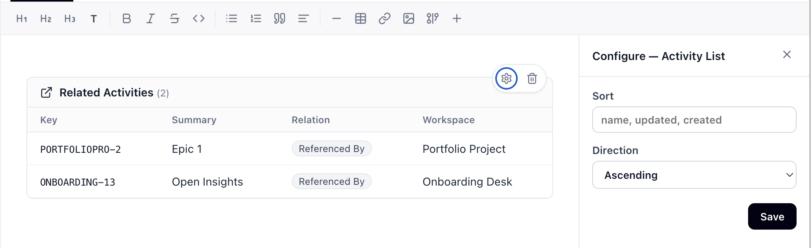

*Configure mirrors search-style filters, column pickers, and sort direction.*

> Distinct from **`/activity` slash**, which inserts an **inline mention** inside a text block, not a table macro. See [Wiki guide — Activity references](wiki.md#activity-references).

---

### Attachments list — `{{attachments-list}}`

Inline list of files attached to the **current page**.

**Syntax**

```markdown
{{attachments-list}}
```

**Configure panel**

- Sort by: Name · Created · Size
- Direction: Ascending / Descending
- Page size: 20 / 50 + **Load more**

Each row shows file type icon, name, size, uploader, and **Download**.

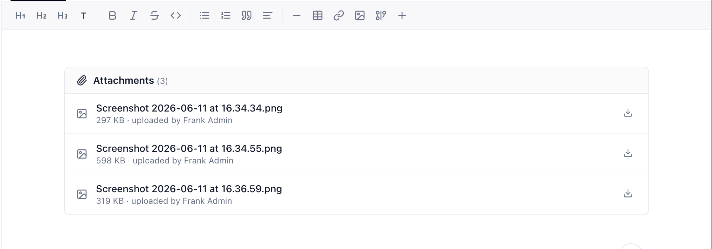

*`{{attachments-list}}` in the page body — filename, size, uploader, download per row.*

> Distinct from the sidebar **Attachments** tab, which is for managing uploads. Use the macro when you want attachments **in the document flow**.

---

### Callouts

Tinted panels for notes, warnings, decisions, tips, and success messages.

#### Block syntax (preferred)

```markdown
{{callout type="info"}}
PostgreSQL 15+ is required for all environments.
{{/callout}}
```

#### Markdown alert syntax (also supported)

```markdown
> [!INFO]
> PostgreSQL 15+ is required for all environments.
```

Both forms render the same in View/Editor. The Markdown tab shows whichever form you stored.

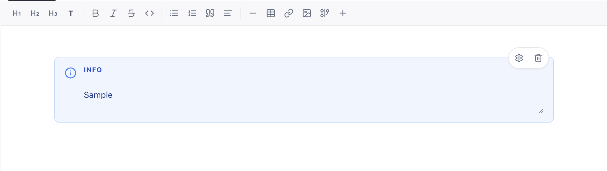

*`{{callout type="info"}}…{{/callout}}` — tinted INFO panel with icon and body text.*

#### Types

| `type` | Label | Typical use |
|--------|-------|-------------|
| `info` | INFO | Neutral information |
| `warning` | WARNING | Caution, risk |
| `decision` | DECISION | Recorded decision |
| `success` | SUCCESS | Confirmation, done state |
| `tip` | TIP | Hint, best practice |

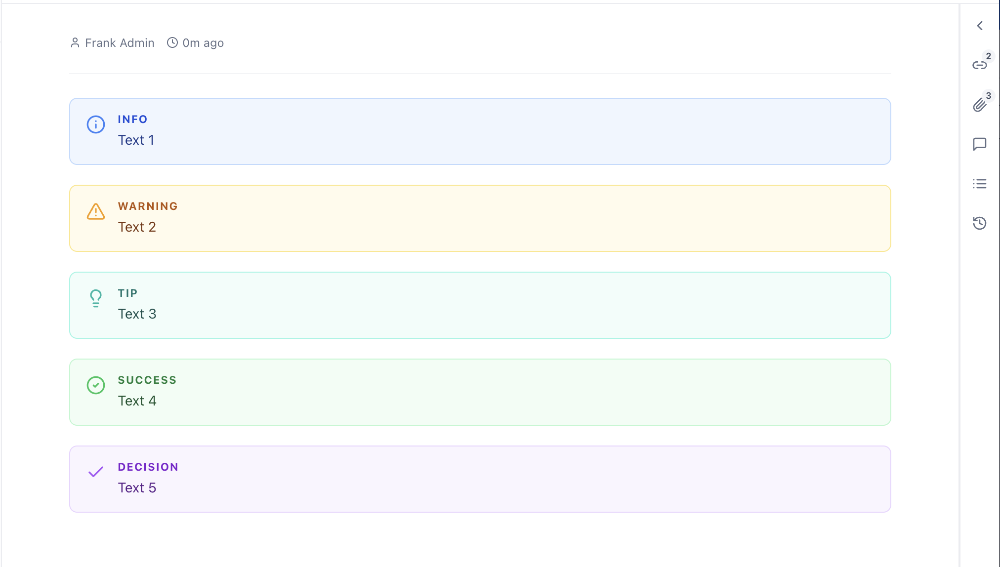

*All five callout types; insert via `/callout` or **Callout — …** in the **+** menu.*

**Insert via slash**

- `/callout` filtered menu, or pick **Callout — info / warning / tip / success / decision** from **+** menu.

**Configure (Edit Render)**

- Vertical type picker with tinted preview rows.
- Edit body text inside the callout block.

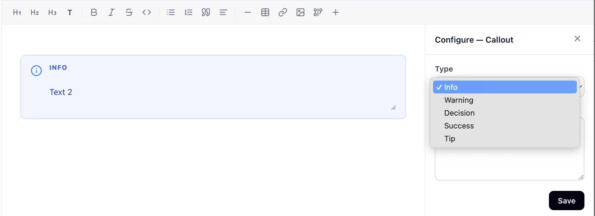

*Configure panel — switch type (info, warning, decision, success, tip) with preview swatches.*

**Limits**

- No nested callouts.
- No callouts inside other macros.

---

## Syntax cheat sheet

| Macro | Minimal syntax |
|-------|----------------|
| TOC | `{{toc}}` |
| Child pages | `{{child-pages}}` |
| Activity list | `{{activity-list}}` |
| Attachments list | `{{attachments-list}}` |
| Callout | `{{callout type="info"}}…{{/callout}}` |

### Attribute style

Boolean and numeric attributes use quoted values:

```markdown
{{child-pages view="gallery" depth="2"}}
{{activity-list columns="key,summary,status"}}
```

Unknown attributes on built-in macros are preserved when possible; unknown **macro types** round-trip as raw tokens.

---

## Non-macro blocks (Editor tab)

These are **structural blocks**, not `{{…}}` macros, but you insert them the same way (`/` or **+**):

| Insert | Stored as |
|--------|-----------|
| **Image** | Markdown image / figure with attachment reference |
| **Mermaid** | ` ```mermaid ` fenced block |
| **Activity** (slash) | Inline `{{nogira-mention:activity:…}}` inside text |
| **Separator** | `---` horizontal rule |
| **Code** | Fenced code block with language tag |

See [Wiki guide — Images and diagrams](wiki.md#images-and-diagrams) for screenshots of image and Mermaid blocks.

---

## Sidebar vs inline macros

| Need | Use |
|------|-----|
| TOC while reading | Sidebar **Contents** tab **or** `{{toc}}` in body |
| Files on this page | Sidebar **Attachments** tab **or** `{{attachments-list}}` in body |
| Backlinks / traceability | Sidebar **Links** tab only |
| Child page index in doc | `{{child-pages}}` macro (not automatic — you insert it) |
| Linked work items table | `{{activity-list}}` macro |

---

## Forward compatibility

Pages may contain `{{…}}` tokens for macro types your instance does not yet register (e.g. future marketplace apps). Those tokens:

- Render as a **verbatim chip** in the editor.
- **Serialize unchanged** on save.
- Do not appear in the slash menu until registered.

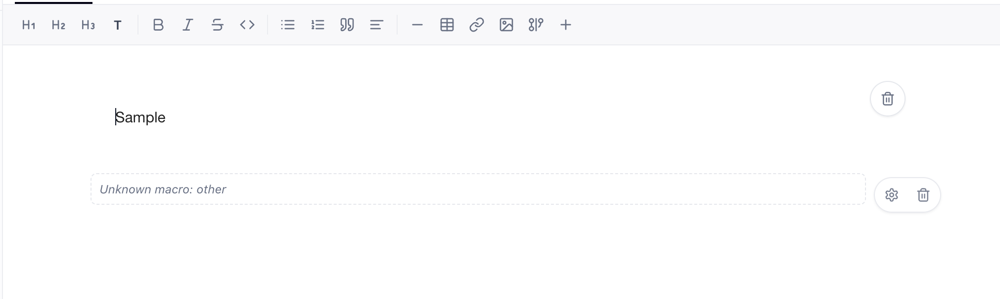

*Unregistered `{{…}}` tokens stay intact on save and render as a read-only chip.*

Your content stays safe across upgrades.

---

## Examples

### Runbook page skeleton

```markdown
# Production deploy

{{callout type="warning"}}
Maintenance window required. Notify #ops before deploy.
{{/callout}}

{{toc}}

## Prerequisites

…

## Child runbooks

{{child-pages view="list" depth="1"}}

## Related work

{{activity-list columns="key,summary,status,assignee"}}

## Artifacts

{{attachments-list}}
```

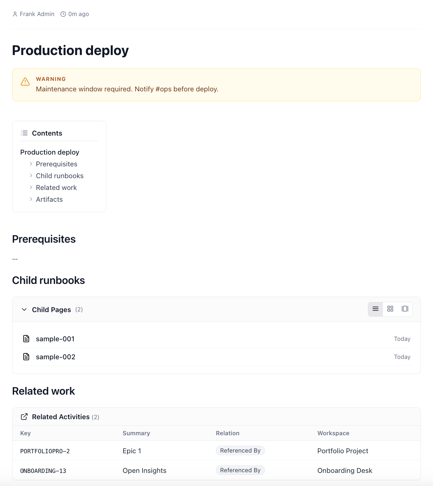

*Sample runbook layout combining warning callout, `{{toc}}`, `{{child-pages}}`, `{{activity-list}}`, and `{{attachments-list}}`.*

### Wiki home hub

```markdown
# Team wiki

{{callout type="tip"}}
Use **Change parent** or drag-and-drop in the sidebar tree to reorganise pages.
{{/callout}}

{{child-pages view="cards" depth="1" sort="updated" direction="desc"}}
```

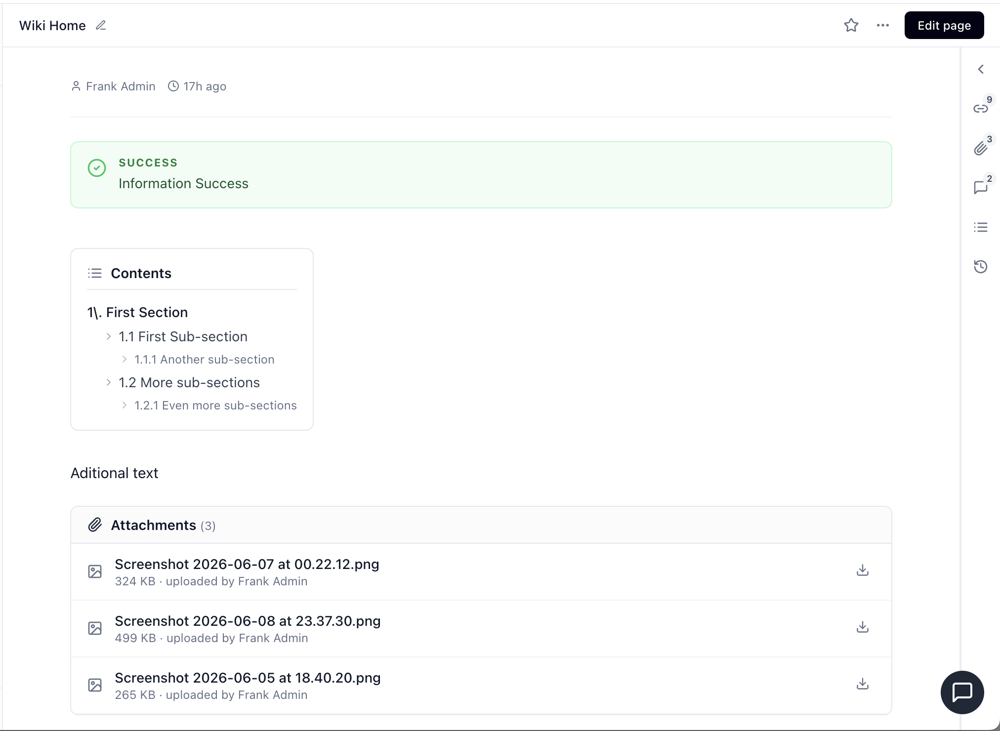

*Wiki Home hub with a tip callout and `{{child-pages}}` in cards view.*

---

## Screenshot assets

Static PNGs for this guide live under [`docs/assets/wiki/`](assets/wiki/). See [`assets/wiki/README.md`](assets/wiki/README.md) for the full filename checklist.

## Related docs

| Doc | Topic |
|-----|--------|
| [Wiki guide](wiki.md) | Pages, editor modes, slash menu, sidebar, tree |
| [MCP Server](mcp.md) | Programmatic read/update via AI clients |
| [Release 0.2.1](releases/0.2.1.md) | Wiki layout polish (NG-721-P9): tree width, collapsible tree, Escape dismiss |
| [Release 0.2.0](releases/0.2.0.md) | Wiki navigation & collaboration release notes |
