# Workspace Wiki

NoGira wiki pages live inside each workspace. Use them for runbooks, specs, onboarding, and knowledge that sits next to boards and activities.

This guide covers **creating and editing pages**, the **block editor**, **formatting**, **slash commands**, and the **Page Context Sidebar**. For macro syntax and configuration, see **[Wiki macros](wiki-macros.md)**.

> Shipped in **NoGira 0.2.0** (NGF-067). Requires a workspace with **View Wiki** permission; editing needs **Edit Wiki**; reparenting and tree drag-and-drop need **Manage Wiki**.

## Open the wiki

1. Open a workspace.
2. Click **Wiki** in the left navigation (book icon).
3. The sidebar shows the page tree rooted at **Wiki Home**.

**Wiki Home** is a real page — it cannot be deleted or moved. New top-level pages are children of Wiki Home, not “orphan” pages with no parent.

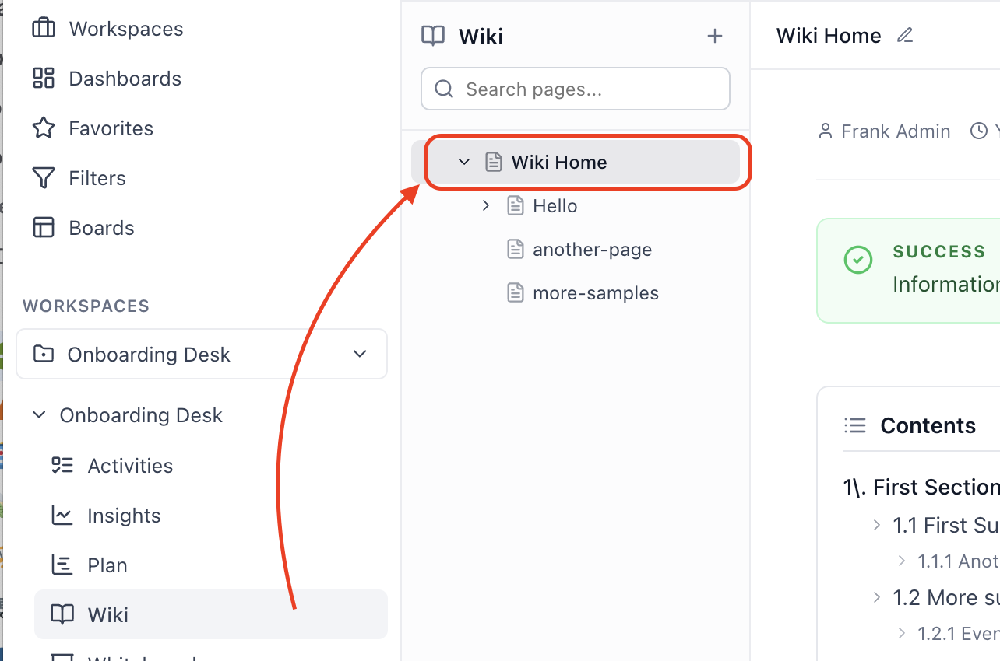

*Wiki entry in the workspace nav and the left page tree rooted at **Wiki Home**.*

### Sidebar tree behaviour

| Behaviour | What you see |
|-----------|----------------|
| **First visit** | Only the first level under Wiki Home is expanded |
| **Refresh** | Your expand/collapse choices are remembered per user and workspace |
| **Deep link** | Opening a nested page auto-expands ancestors so the current page is visible |
| **Search** | Use the wiki sidebar search to find pages by title |

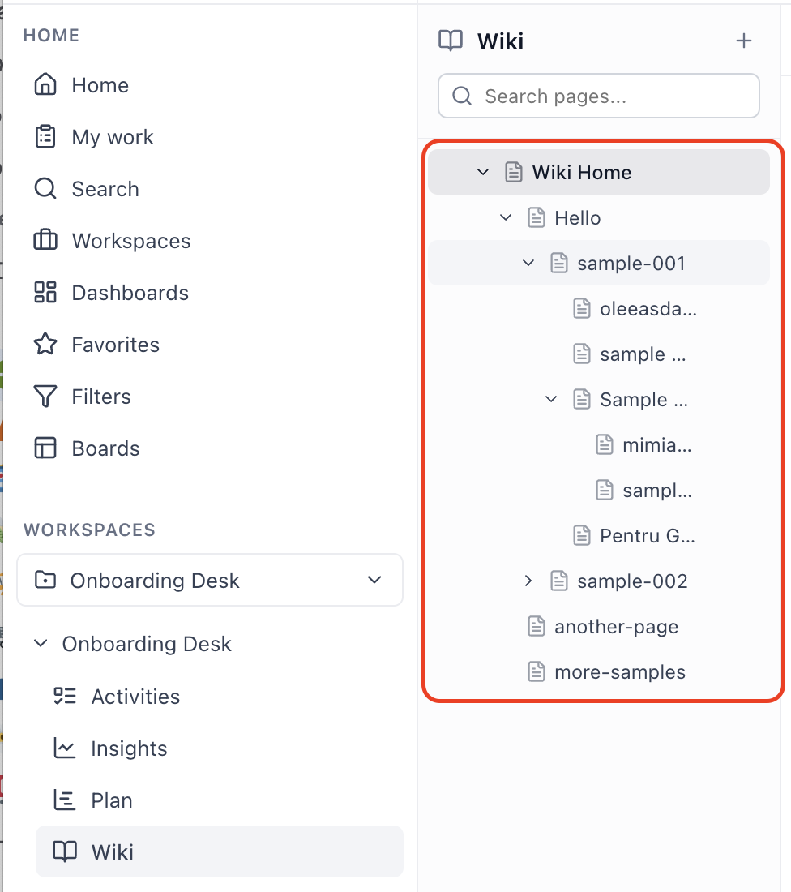

*First-level default expansion, persisted collapse state, and sidebar search.*

### Organise the tree

**Change parent (modal)**

1. Open a page.
2. Click **`…`** on the page header (or the tree row menu).
3. Choose **Change parent**.
4. Pick a new parent from **recents** or **workspace search** (same workspace only).
5. Confirm — children, attachments, comments, links, and history stay on the page.

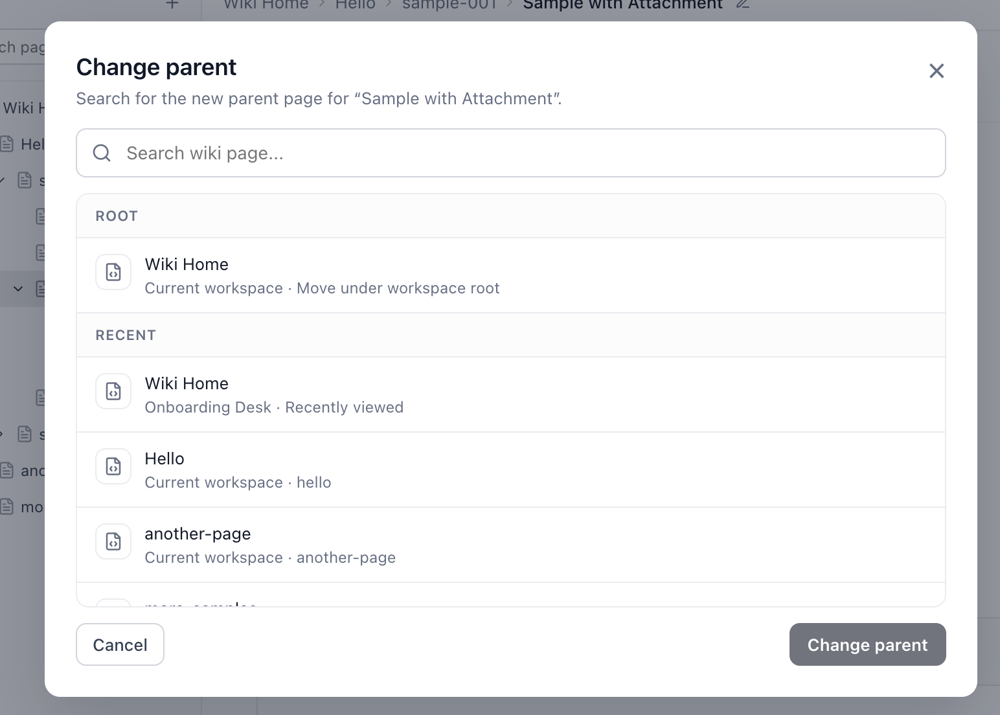

*Pick a new parent from recents or search; cycle moves are blocked.*

**Drag and drop**

| Drop target | Result |
|-------------|--------|
| **Insert line** between siblings | Reorder within the same parent |
| **On a page row** | Reparent as the last child of that page |

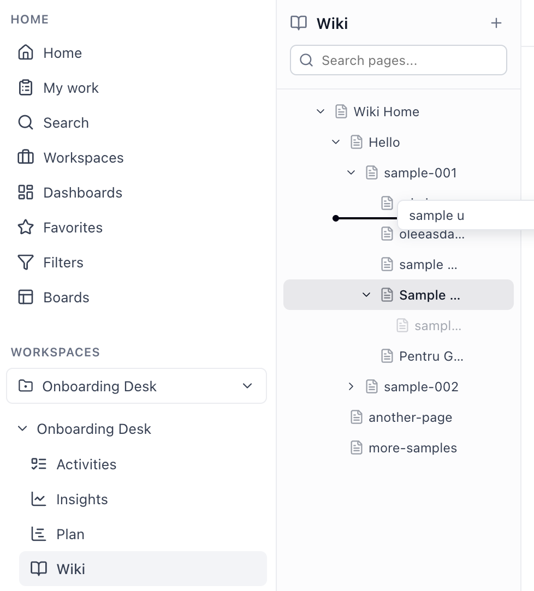

*Drop on the insert line to reorder siblings; drop on a row to reparent under that page.*

Rules:

- You can only drag **visible** nodes.
- To drop into a collapsed branch, **expand it first**.
- You cannot create circular parent chains.
- **Wiki Home** cannot be moved or deleted.

## Create and manage pages

| Action | How |
|--------|-----|
| **New sub-page** | Page `…` menu → **New sub-page**, or create from the tree |
| **Duplicate** | Page `…` menu → **Duplicate** |
| **Archive** | Page `…` menu → **Archive** (see deployment docs for archive workflow) |
| **Rename** | Edit the title in the page header while editing |

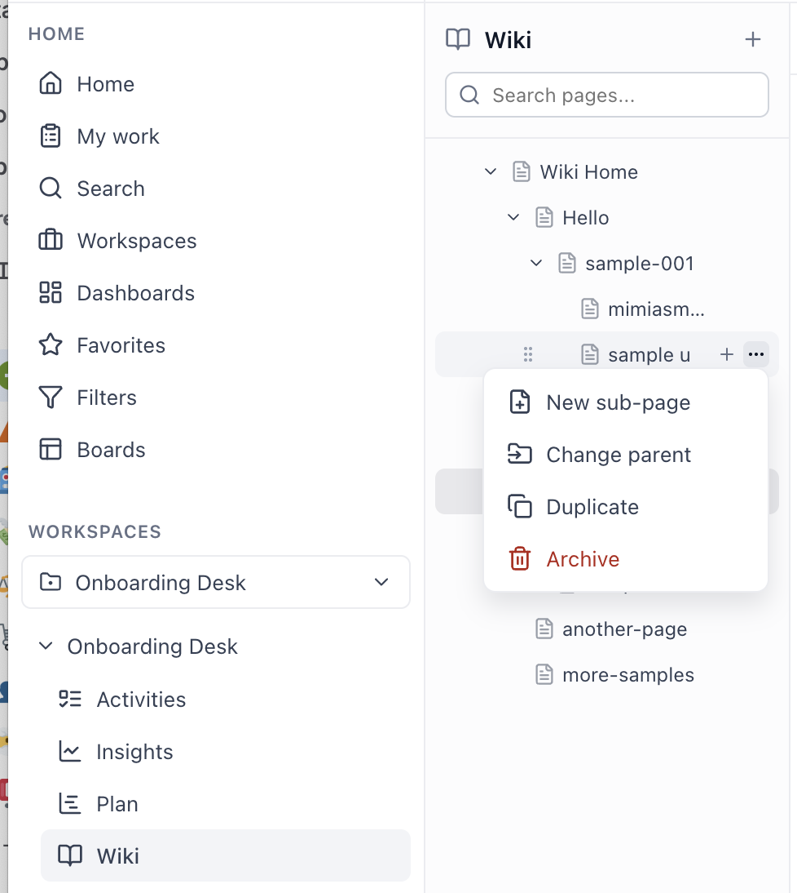

*Page header `…` menu and common page lifecycle actions.*

After you save, the page appears in the tree under its parent. Use **`{{child-pages}}`** in page body to list children in the content area — see [Wiki macros](wiki-macros.md#child-pages).

## Editor modes

Every wiki page has three ways to work with content:

| Mode | Tab | Best for |
|------|-----|----------|
| **View** | **View** | Reading finished pages; macros and images render fully |
| **Edit Render** | **Editor** | Day-to-day authoring — blocks, macros, images, slash menu |
| **Edit Markdown** | **Markdown** | Power users, paste/import, exact `{{…}}` syntax |

```text
View          → rendered blocks + prose (read-only)
Editor        → block editor — click a block to edit; macros show Configure
Markdown      → raw stored markdown only
```

Click **Edit** on the page header to enter edit mode. **Save** persists `contentMarkdown` to the server. **Cancel** discards unsaved edits.

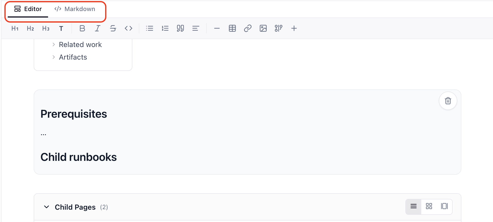

*Switch between **View**, **Editor**, and **Markdown**; **Save** / **Cancel** in the header.*

### Block editor (Editor tab)

The Editor tab is an **all-block editor**. Each unit of content is a block:

| Block kind | What it is |
|------------|------------|
| **Text** | Headings, paragraphs, lists, tables, links, bold/italic — edited in a focused rich-text area |
| **Separator** | Horizontal rule (`---`) |
| **Code** | Fenced code block with language |
| **Image** | Figure with attachment or URL; width, alignment, caption |
| **Diagram** | Mermaid diagram block |
| **Macro** | `{{toc}}`, `{{child-pages}}`, callouts, etc. — see [Wiki macros](wiki-macros.md) |
| **Unknown** | Unrecognised `{{…}}` tokens — preserved verbatim on save |

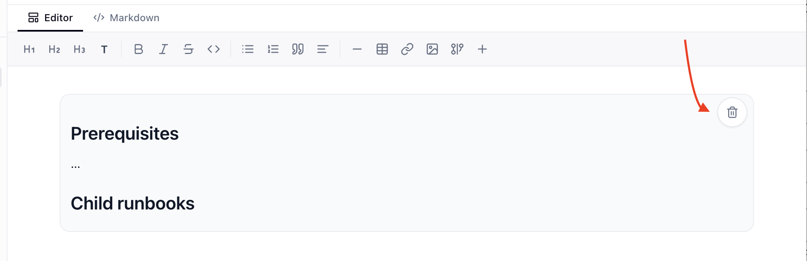

*Editor tab with multiple block types; macro blocks show **Configure** in edit mode.*

**Block chrome (Edit Render)**

- Click a block to focus it.
- **Configure** (gear) on macro blocks opens the right configuration panel.
- **Delete** removes the block.
- Only one **text** block mounts the full rich editor at a time (keeps large pages fast).

### Formatting toolbar

While a **text** block is focused, the toolbar supports:

- Headings, bold, italic, strikethrough
- Bullet and numbered lists
- Links
- **+** insert menu (same commands as `/` slash — see below)

Standard Markdown shortcuts work inside the focused text block where supported.

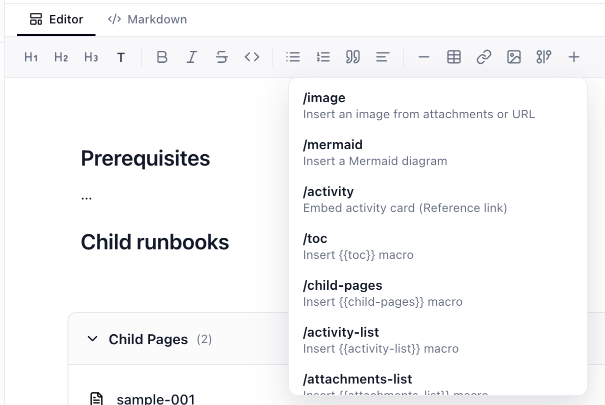

*Rich-text toolbar on a focused text block; **+** opens the same insert list as `/`.*

## Slash commands (`/`)

In the **Editor** tab, type **`/`** inside a text block to open the insert menu. Filter by typing (e.g. `/toc`, `/call`).

| Command | Inserts |
|---------|---------|
| **Image** | Opens image insert modal (attachment upload or URL) |
| **Mermaid** | Opens diagram editor |
| **Activity** | Embeds an activity reference (inline mention token) |
| **Table of contents** | `{{toc}}` |
| **Child pages** | `{{child-pages}}` |
| **Activity list** | `{{activity-list}}` |
| **Attachments list** | `{{attachments-list}}` |
| **Callout — info / warning / tip / success / decision** | Callout block — see [Callouts](wiki-macros.md#callouts) |

The toolbar **+** button opens the same list without typing `/`.

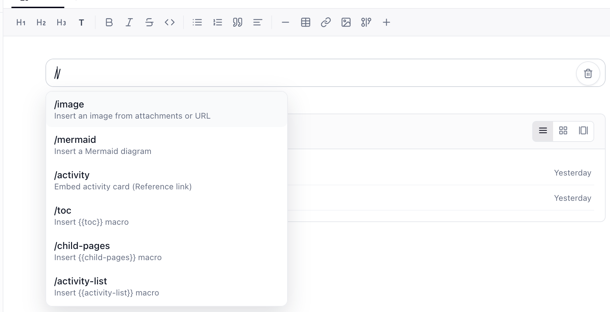

*Type `/` in a text block to filter commands; macros and media inserts appear in one list.*

After choosing a command, the editor inserts the block or markdown token at the caret. **Save** to persist; **View** shows the rendered result.

> **Tip:** In the **Markdown** tab you can paste macro syntax directly. Switch back to **Editor** to configure macros visually.

## Page Context Sidebar

The right-hand **context column** works in **view and edit** mode.

```text
┌──────────────── Page content ────────────────┐
│  headings, macros, body                    │
└────────────────────────────────────────────┘
┌─ Panel (when expanded) ─┐ ┌─ icon strip ─┐
│  one active tab         │ │ 🔗 📎 💬 ☰ 🕒 │
└─────────────────────────┘ └───────────────┘
```

Click an icon to expand the panel. Only **one tab** is active at a time. Click **`>>`** or the collapse control to return to the icon strip only.

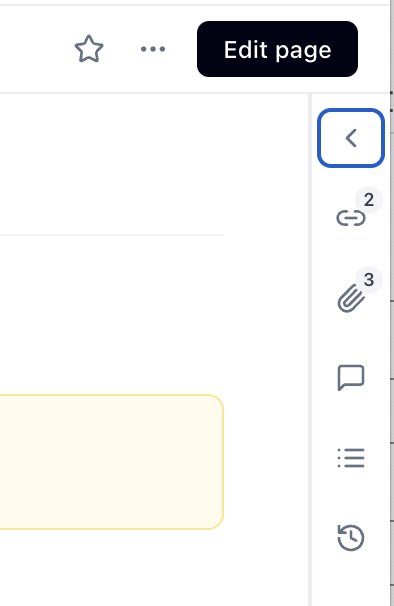

*Collapsed icon strip on the right; one tab expands into the context panel.*

| Tab | Icon | Purpose |
|-----|------|---------|
| **Links** | 🔗 | Activities, wiki pages, and whiteboards linked to this page (traceability) |
| **Attachments** | 📎 | Files on this page — upload when you can edit |
| **Comments** | 💬 | Page-level comments (thread + compose) |
| **Contents** | ☰ | Table of contents from **H1–H3** headings (same data as `{{toc}}`) |
| **History** | 🕒 | Page events — create, rename, edit, parent change, link add/remove |

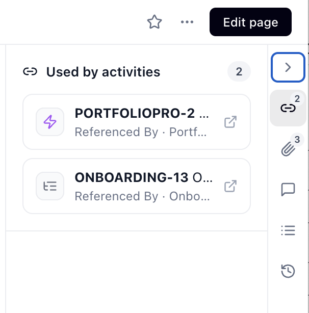

***Links** tab — grouped relationships to activities, wiki pages, and whiteboards.*

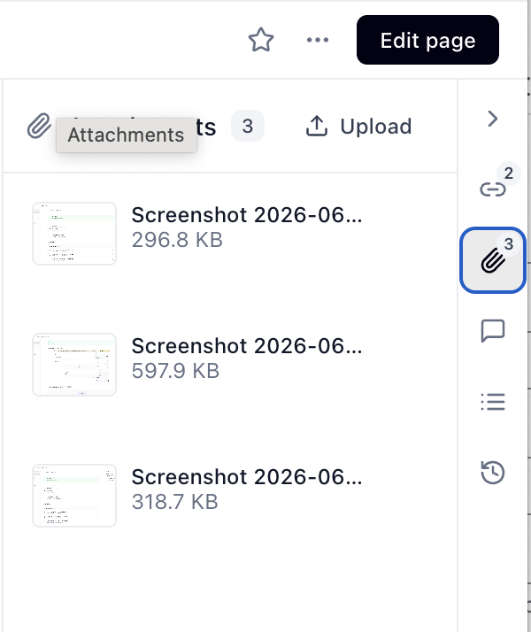

***Attachments** tab — file list, upload, and download (distinct from the `{{attachments-list}}` macro).*

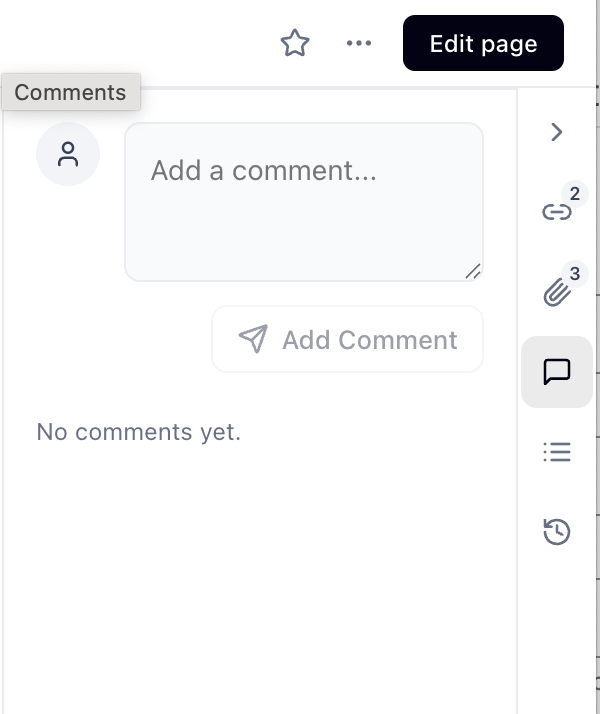

***Comments** tab — page-level comments while viewing or editing.*

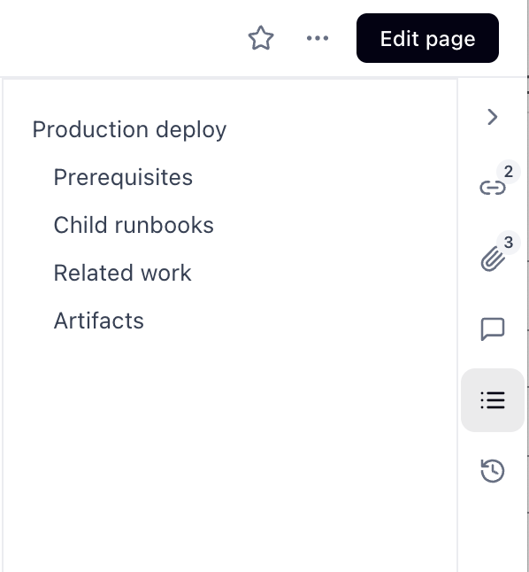

***Contents** tab — H1–H3 index for the current page (same headings as `{{toc}}`).*

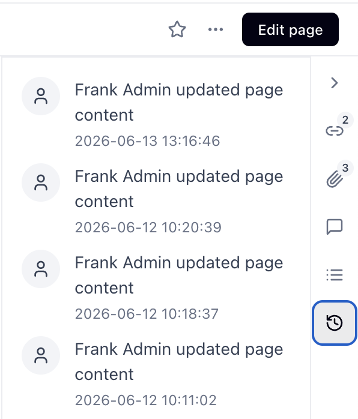

* **History** tab — create, rename, content update, parent change, and link events.*

**Links vs macros**

- **Links tab** — relationships and backlinks (who references this page).
- **`{{activity-list}}` macro** — a formatted table **inside** the page body.

**Attachments vs macros**

- **Attachments tab** — upload, download, manage files for the page.
- **`{{attachments-list}}` macro** — inline list block in the body.

## Images and diagrams

**Images**

1. Type `/image` or use toolbar **+ → Image**.
2. Upload a workspace attachment or paste an allowed URL.
3. In Edit Render, use block chrome to set width, alignment, caption, or replace the image.

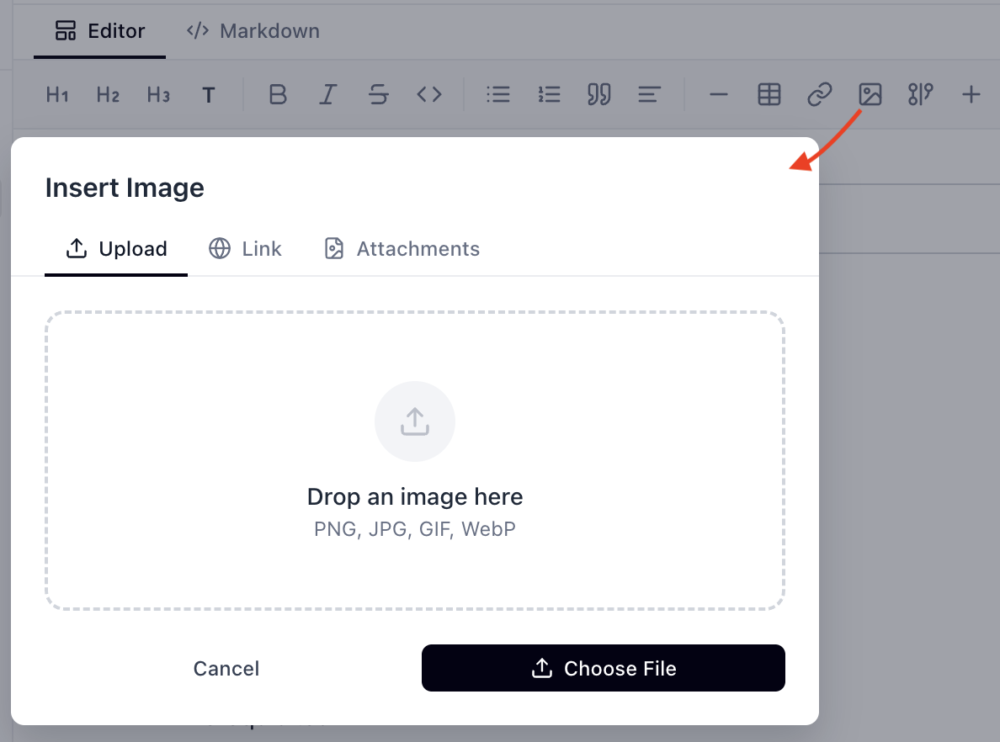

*Image insert modal (attachment or URL) and the image block with alignment options.*

**Mermaid**

1. Type `/mermaid` or use **+ → Mermaid**.
2. Edit diagram source in the modal or configuration panel.
3. View and Editor tabs render the diagram when syntax is valid.

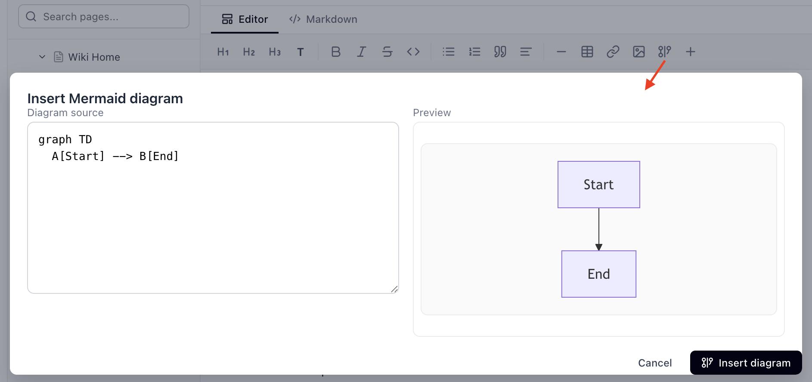

*Mermaid source editor and rendered diagram block in the page.*

## Activity references

| Mechanism | Use case |
|-----------|----------|
| **`/activity` slash** | Inline mention inside prose — stable `{{nogira-mention:activity:…}}` token |
| **`{{activity-list}}` macro** | Table of linked activities with configurable columns and filters |

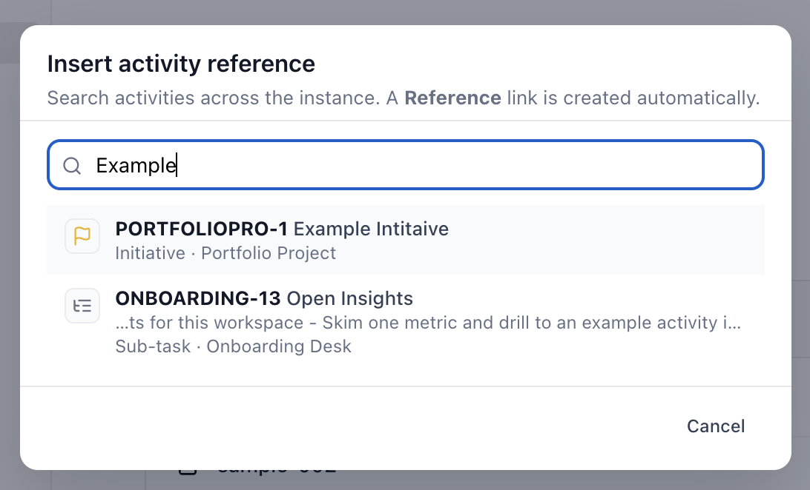

*`/activity` inserts an inline activity mention inside a text block (not the activity-list table macro).*

See [Relationships & Traceability](../README.md#relationships--traceability) in the main README for link types (Blocks, Relates To, Specification, etc.).

## Permissions

| Permission | Allows |
|------------|--------|
| **View Wiki** | Open pages, sidebar, view mode |
| **Edit Wiki** | Edit content, comments, attachments upload |
| **Manage Wiki** | Change parent, tree drag-and-drop, archive |
| **Comment Wiki** | Add page comments |

If you lack permission, edit actions and some sidebar controls are hidden.

## Markdown storage

- The server stores **one markdown string** per page (`contentMarkdown`).
- The block editor **round-trips** to that string on save.
- Unrecognised `{{…}}` macros are kept as-is for forward compatibility.
- Prefer **Editor** for macros; use **Markdown** for bulk paste, Git-style review, or automation.

## Quick reference

| Task | Steps |
|------|--------|
| New page | `…` → **New sub-page** |
| Move in tree | **Change parent** or drag-and-drop |
| Insert TOC | `/toc` → Save |
| List child pages | `/child-pages` on a parent page |
| Info callout | `/callout` or pick **Callout — info** |
| See who links here | Sidebar **Links** tab |
| See edit history | Sidebar **History** tab |

## Overview (animated)

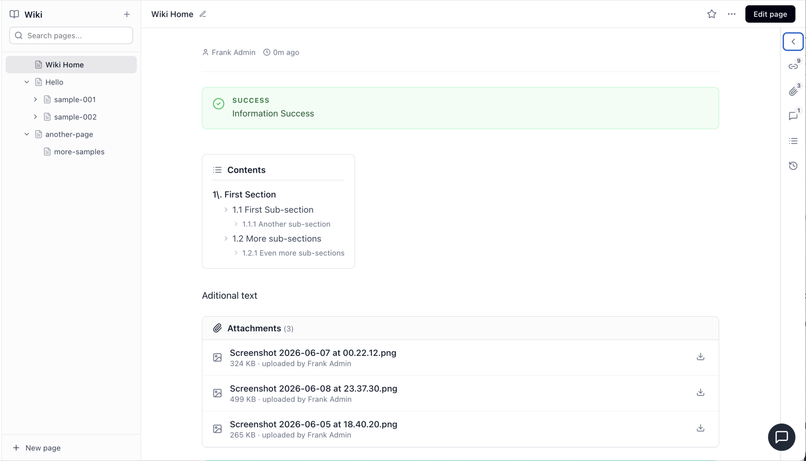

*Editor tab with slash insert, macro blocks, Configure panel, and the Page Context Sidebar.*

## Screenshot assets

Static PNGs for this guide live under [`docs/assets/wiki/`](assets/wiki/). See [`assets/wiki/README.md`](assets/wiki/README.md) for the file checklist.

## Related docs

| Doc | Topic |
|-----|--------|
| [Wiki macros](wiki-macros.md) | `{{toc}}`, `{{child-pages}}`, callouts, configure panels |
| [MCP Server](mcp.md) | AI clients — `getWikiPage`, `updateWikiPage`, `changeWikiPageParent` |
| [Relationships (README)](../README.md#relationships--traceability) | Links panel and activity/wiki references |
